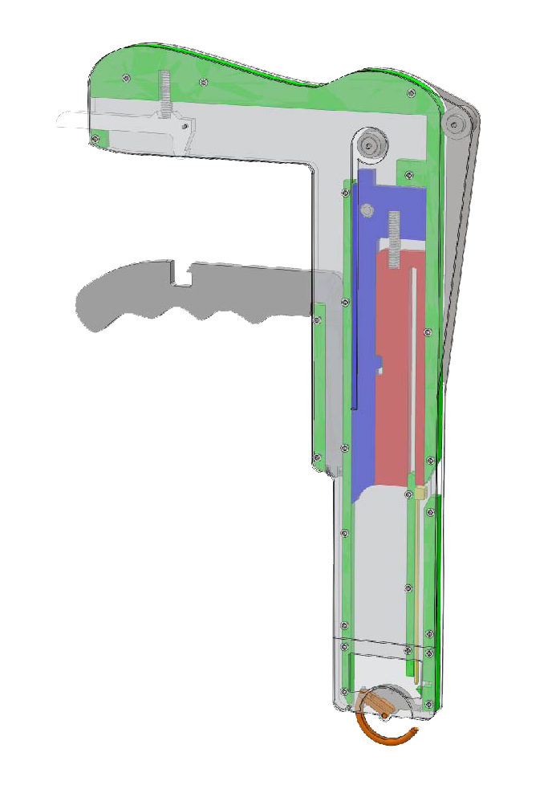

## Motivation

I am passionate about designing, prototyping and validating robotic hardware for applications where the mechanics of the system are critical to functionality. Most of my projects integrate a mixture of mechanical design, electronics, software and analysis of system dynamics to achieve this. 

As a mechanical engineer, I'm rooted in the applied. That being said, my most recent position has allowed me to brush up on open-source software packages that have been pushing robotics forward. In addition to the delight of seeing prototypes move for the first time, I deeply enjoy the process of creating context around the engineering problems I am immersed in. Recently I have become hell-bent on documentation; I think usability, reproducibility, and portability of research are often significant barriers to progressing robotics, or any field, together. 

Early inspiration to go into engineering includes vague memories of bio-inspired robots on television during high school, videos of [Raibert's first hopping robots](https://www.youtube.com/watch?v=XFXj81mvInc) from the late '80s, undergraduate research with the [Biomimetic Robotics Lab at MIT](http://biomimetics.mit.edu/), and a broad interest as to why biological systems often beat out robots when it comes to interacting with their environment ([Cats Paws and Catapults](https://www.goodreads.com/book/show/223609) is my favorite read on this).

## Academic Projects

### ME218: Smart Product Design (Stanford M.S. Depth 2012-2013)
Three-quarter, project-based graduate course on prototyping embedded systems. 
Each quarter concluded with an intensive final project (often with a quirky theme) which was completed in teams of four:

---
 

#### Interactive Arcade Game
Two player, Batman-themed game that pitted opponents against each other as they quickly hit flashing LED's. 
Game startup included triggering an IR sensor with a 'secret code' then arousing an accelerometer worn by the user as a 'warm up'. 

- [website](http://combatbybatdog.weebly.com/)
- [video](https://www.youtube.com/watch?v=9w4HHpkAdsU&feature=youtu.be)

#### Autonomous "Battleship" Competition
Constructed autonomous robot to navigate 10’x10’ playing field shooting opponent’s targets in a final tournament

- [website](http://theflyingdutchmanbattlebot.weebly.com/)
- [video](https://www.youtube.com/watch?v=hMokzTTTHaQ&feature=youtu.be)

#### Wirelessly Controlled Rover

Designed and constructed a remote-controlled robot to handle wireless commands using an event-driven software framework and a SPI communication network between PIC16F690 chips.

- [website](http://theedcarryerexperience.weebly.com/)
- [video](https://www.youtube.com/watch?v=gW6jbdK065M)

---

<!-- # == EE368: Digital Image Processing (Stanford Spring 2015)
# ~~~
# {}{img_left}{images/EE368faces.png}{alt text}{150}{}{}

# I worked with classmate Amanda Stowers to visualize heartbeat in peoples' faces. 
# We worked off of the MIT Eulerian Video Magnification code and extended it to identify two faces, amplify the detected heartbeat frequency in each, then remerge the video.

# [docs/EE368_report.pdf final report]\n
# [docs/EE368_poster.pdf poster]\n
# [https://github.com/pinum314/EE368project git repository]

# ~~ -->

### ME2.750: Precision Machine Design (MIT Fall 2011)
 

I worked as part of a student team of five, advised by a surgeon, to develop the SutureTie, a hand-held device that used zip-tie sutures to occlude blood flow through discrete sections of the liver.
Our team ultimately produced a proof-of-concept prototype which was demonstrated on an ex-vivo, porcine liver. 

The project provided experience defining functional requirements, combing through prior art, working with regular input from our assigned surgeon, and able to sit in on a liver resection.  

[poster presentation](../assets/docs/DMDposter_RevD.pdf )