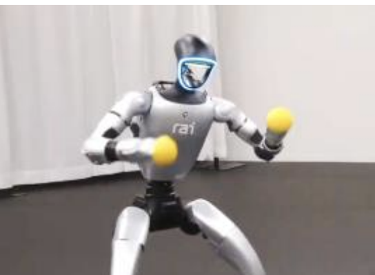
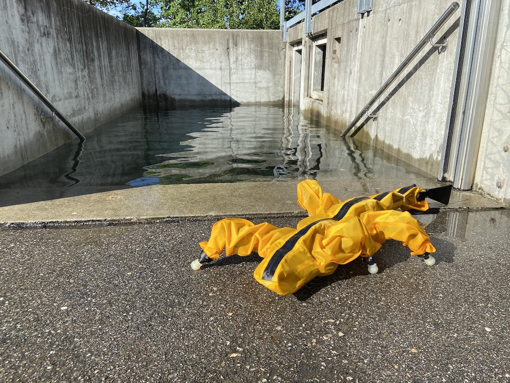
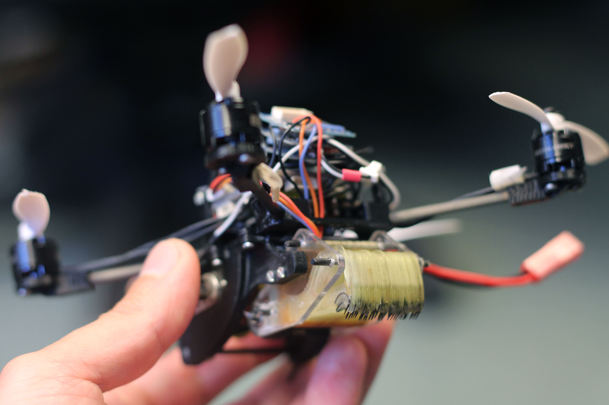
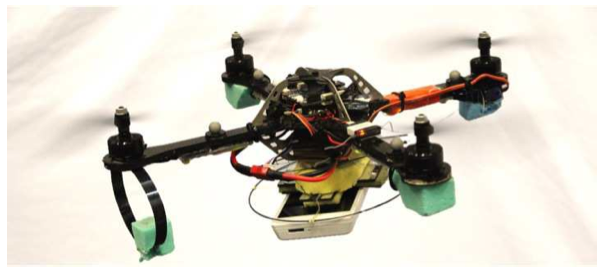

Highlighted industry and research experiences.

### Robotics and AI Institute

Research Scientist, December 2023 – Present

Whole body and grasping reinforcement learning policy development with deployment onto humanoid platforms. Contributor to pipeline used on G1 and E-Atlas motions for external BD collaboration. Sim-real gap analysis and mitigation including data driven methods, modeling parallel linkage actuators, and experiment analysis pipeline. Simulation, trajectory optimization, and software integration for low-impedance manipulators and end-effectors.

---

### Agility Robotics

Senior Software Engineer — Manipulation Autonomy, November 2022 – November 2023

[Agility Robotics](https://agilityrobotics.com/) manipulation team contributing to the autonomy stack for humanoid robot Digit, focused on manipulation tasks for large items in warehouse applications.

- Requirements-driven development of autonomy behaviors targeted at deployment. Analysis and sensor selection for manipulation metrics.
- Optimization-based stance generation for whole body control.
- Managed two direct reports, mentored on development practices and bring-up of experimental hardware.

---

### Relativity Space

Senior Robotics Software Engineer, June 2021 – October 2022

[Relativity Space](https://www.relativityspace.com/) Robotics Software team building the in-house stack for large area additive manufacturing to print rocket bodies.

- Robot simulation and model definition for IK and motion planning. Sensor hardware integration and online obstacle avoidance.
- Hard real-time controller running on industrial Kuka arms for large-area additive manufacturing.
- Spec'ing and integrating instrumentation for controller validation, weld monitoring during prints, and dimensional scanning.
- Built tooling to provision compute machines, CICD, and standardize Linux development environment.

---

### Disney

Imagineer — "Stuntronics" Team, Feb.–Mar. 2019

Short project with [Disney Research](https://la.disneyresearch.com/) conceiving and building proof-of-concept for alternative methods of dynamic stabilization for legged robots.

- [Patent](https://patentimages.storage.googleapis.com/13/37/91/ee6a2cffc35ddb/US11292126.pdf)
- [Video clip](https://youtu.be/lPqzLE4KjhI?si=VLVaysxmdT8maLOF&t=364) - adjacent project using parts of my stabilizing prototype.

---

### Amphibious Field Robot

EPFL Biorobotics Lab — Collaborateur Scientifique, April 2019 – May 2021

Lead maintainer of amphibious, sprawling gait, 21 DoF robot for locomotion across rough terrain. C++ swimming locomotion controller, refactor and CMake compilation, integrated ROS Noetic for experiment data collection. Robotics lead for IDSIA collaboration for gait-dependent traversability CNN estimator pipeline across rough terrain.

Recruited and supervised 5 Master's student projects and 3 internships, managed NCCR and ARCHE program reporting.

- [Robot controller repository](https://gitlab.com/biorob-krock/krock-controller)
- [Traversability estimation repo](https://gitlab.com/biorob-krock/idsia-traversability) (IDSIA collaboration)

---

### Flying, Tugging, Micro Air Vehicles

Stanford BDML — Graduate Research Assistant, Sept. 2012 – Aug. 2018

Designed and demonstrated 100-gram aerial vehicles outfitted with controllable adhesives, allowing them to tug up to 4 kg. Manually operated two vehicles to demonstrate opening a door during exchange at [EPFL LIS](https://lis.epfl.ch/) under a [Swiss scholarship](https://www.sbfi.admin.ch/sbfi/en/home/bildung/scholarships-and-grants/swiss-government-excellence-scholarships-for-foreign-scholars-an.html) and [NSF GROW](https://www.nsf.gov/funding/pgm_summ.jsp?pims_id=504876).

- [Science Robotics Paper](http://robotics.sciencemag.org/content/3/23/eaau6903)
- [Stanford News](https://news.stanford.edu/2018/10/24/small-flying-robots-haul-heavy-loads/)
- [MIT Technology Review](https://www.technologyreview.com/the-download/612344/wasp-inspired-robots-can-lift-40-times-their-own-weight-and-work-together-to/)
- [Wired](https://www.wired.com/story/wasp-like-drones/)
- [Science Magazine](https://www.sciencemag.org/news/2018/10/tiny-wasp-inspired-drone-can-pull-40-times-its-own-weight)
- [IEEE Spectrum](https://spectrum.ieee.org/automaton/robotics/drones/tiny-drones-team-up-to-open-doors)

---

### Perching Micro Air Vehicles

Mechanism design, integration, and failure recovery for dynamic perching of quadrotors on smooth, vertical surfaces. Designed gecko adhesive grippers and collaborated with a controls group at UPenn to demonstrate perching under indoor motion capture.

- [NYTimes — "What You Get When You Blend a Drone and a Gecko"](http://www.nytimes.com/2015/05/16/science/robot-part-drone-part-gecko.html?_r=0)
- [Video — collaboration with Vijay Kumar's group at UPenn](https://www.youtube.com/watch?v=P1t_cZqgsR8)
- [BDML perching page](http://bdml.stanford.edu/Main/DynamicRotorcraftPerchingMechanisms)

---

### Force Sensing Footpad

MIT Biomimetic Robotics Lab — Undergraduate Researcher, Winter 2010 – Spring 2012

Designed and fabricated structure of soft force sensor intended for use in the paw pad of the MIT Cheetah robotic quadruped. Used 3D printed molds to cast a woven fiberglass cloth into a polyurethane film encasing a softer silicone. Hall effect sensors were mounted above magnets on the deformable pad and deflection was correlated to force.

- [Paper](https://ieeexplore.ieee.org/abstract/document/6386239/)
- [video](https://www.youtube.com/watch?v=_6Rvv9s5hko)
- [Undergraduate thesis](https://dspace.mit.edu/handle/1721.1/74436)

