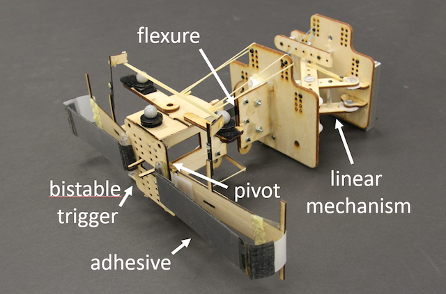

## Industry

### Agility Robotics

[Agility Robotics](https://agilityrobotics.com/) manipulation team contributing to the autonomy stack for humanoid robot Digit, focused on manipulation tasks for large items in warehouse applications.

---

### Relativity Space

[Relativity Space](https://www.relativityspace.com/) Robotics Software team working creating our in-house stack for large area additive manufacturing process to print rocket bodies.

---

### Disney

Short project with [Disney Research](https://la.disneyresearch.com/) focused on alternative modes of balance for legged locomotion.

- [Patent](https://patentimages.storage.googleapis.com/13/37/91/ee6a2cffc35ddb/US11292126.pdf)
- [Video clip](https://youtu.be/lPqzLE4KjhI?si=VLVaysxmdT8maLOF&t=364) - adjacent project using parts of my stabilizing prototype.

---

## Research

See [Google Scholar](https://scholar.google.com/citations?user=R6kgerwAAAAJ&hl=en) for a complete list of publications.

---

### Amphibious Field Robot

I was the maintainer continuing development of our k-rock 2 sprawling-gait quadruped robot, made up of 21 Dynamixel motors and controlled via an ODROID XU4 running Linux. I implemented a surface swimming gait on the robot via an undulating tail and spine. We are using simulation and laboratory experiments to predict what obstacles the robot can and cannot traverse.

Engineering work has involved layering ROS onto the C++ controller architecture and revamping our compilation procedure with CMake. I recruit and supervise projects, internships, and collaborations on the hardware.

- [Robot controller repository](https://gitlab.com/biorob-krock/krock-controller)
- [Traversability estimation repo](https://gitlab.com/biorob-krock/idsia-traversability) (IDSIA collaboration)

---

### Flying, Tugging, Micro Air Vehicles

Work with the [Laboratory of Intelligent Systems](https://lis.epfl.ch/) at EPFL during my PhD exchange under a [Swiss scholarship](https://www.sbfi.admin.ch/sbfi/en/home/bildung/scholarships-and-grants/swiss-government-excellence-scholarships-for-foreign-scholars-an.html) and [NSF GROW](https://www.nsf.gov/funding/pgm_summ.jsp?pims_id=504876). We combined aerial locomotion with the ability to tug with high forces by attaching onto the environment with adhesives.

- [Science Robotics Paper](http://robotics.sciencemag.org/content/3/23/eaau6903)
- [Stanford News](https://news.stanford.edu/2018/10/24/small-flying-robots-haul-heavy-loads/)
- [MIT Technology Review](https://www.technologyreview.com/the-download/612344/wasp-inspired-robots-can-lift-40-times-their-own-weight-and-work-together-to/)
- [Wired](https://www.wired.com/story/wasp-like-drones/)
- [Science Magazine](https://www.sciencemag.org/news/2018/10/tiny-wasp-inspired-drone-can-pull-40-times-its-own-weight)
- [IEEE Spectrum](https://spectrum.ieee.org/automaton/robotics/drones/tiny-drones-team-up-to-open-doors)

---

### NASA Free Flyer Gripper

Collaboration between the Biomimetics and Dexterous Manipulation Lab and [Autonomous Systems Lab](http://asl.stanford.edu/) on a NASA Early Stage Innovations grant. We were aiming to equip [Assistive Free Flyers](http://ssl.mit.edu/spheres/) (AFFs), small robots on the International Space Station, with gecko-gripper appendages to aid astronauts.

My contribution focused on adapting a curved surface, gecko adhesive gripper for use on a free flyer table. We modeled force constraints of the gripper and dynamics while grasping translating, spinning objects and experimentally verified the boundaries of successful grasp conditions on a 2D testbed.

- [Video](https://www.youtube.com/watch?v=1yS63Nrak1Q)
- [Paper](https://ieeexplore.ieee.org/document/7989329/)
- [Paper](https://ieeexplore.ieee.org/document/7487696/)
- [NASA ESI Grant](http://www.nasa.gov/feature/assistive-free-flyers-with-gecko-inspired-adhesive-appendages-for-automated-logistics-in)

---

### Perching Micro Air Vehicles

I was part of our group enabling MAVs to perch and take a rest on vertical surfaces. With a typical mission life lasting on the order of 20 minutes, it is a welcome break for the MAV to collect data or recharge.

We designed gecko adhesive grippers that will stick to smooth, flat surfaces and collaborated with a controls group at UPenn to demonstrate perching under indoor motion capture.

- [NYTimes — "What You Get When You Blend a Drone and a Gecko"](http://www.nytimes.com/2015/05/16/science/robot-part-drone-part-gecko.html?_r=0)
- [Video — collaboration with Vijay Kumar's group at UPenn](https://www.youtube.com/watch?v=P1t_cZqgsR8)
- [BDML perching page](http://bdml.stanford.edu/Main/DynamicRotorcraftPerchingMechanisms)

---

### Sensing Footpad (MIT Undergraduate Research)

I designed and manufactured the structure of a soft force sensor for my senior thesis in the Biomimetics and Dexterous Manipulation Lab at MIT, supervised by (then) graduate student Michael Chuah. The force sensor was intended for use in the paw pad of the MIT Cheetah.

I used a series of 3D printed molds to cast a woven fiberglass cloth into a polyurethane film that encased a softer silicone. Hall effect sensors were mounted above magnets on the deformable pad and deflection was correlated to force.

- [Paper](https://ieeexplore.ieee.org/abstract/document/6386239/)
- [Undergraduate thesis](https://dspace.mit.edu/handle/1721.1/74436)

