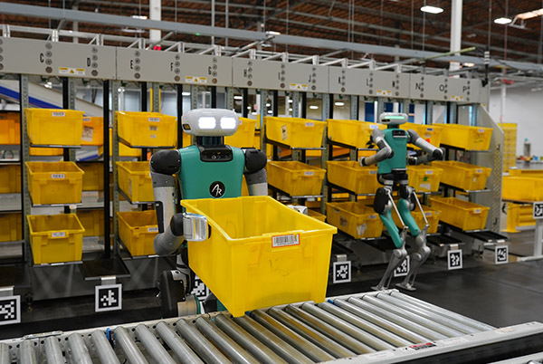
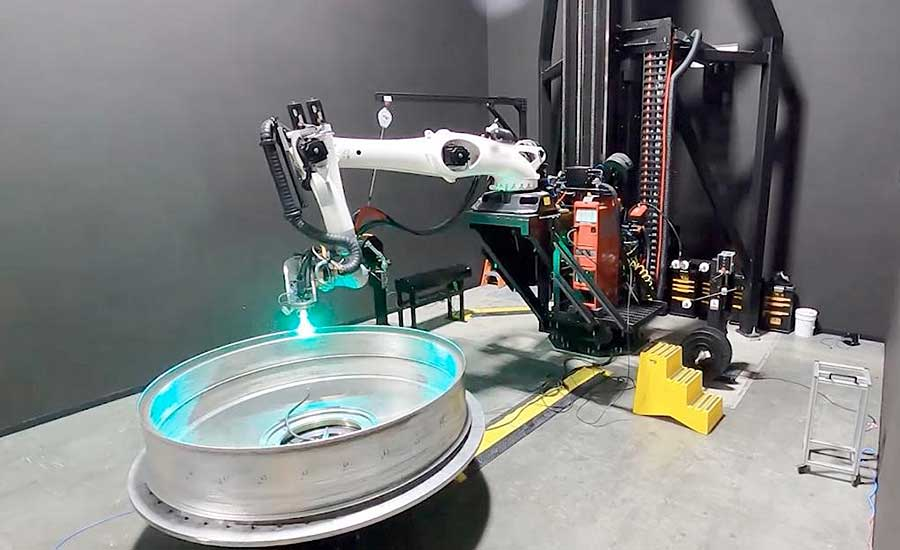
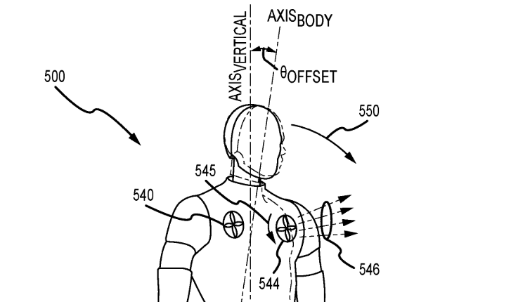

## Industry

### Agility Robotics

[Agility Robotics](https://agilityrobotics.com/) manipulation team contributing to the autonomy stack for humanoid robot Digit, focused on manipulation tasks for large items in warehouse applications.

---

### Relativity Space

[Relativity Space](https://www.relativityspace.com/) Robotics Software team working creating our in-house stack for large area additive manufacturing process to print rocket bodies.

---

### Disney

Short project with [Disney Research](https://la.disneyresearch.com/) focused on alternative modes of balance for legged locomotion.

- [Patent](https://patentimages.storage.googleapis.com/13/37/91/ee6a2cffc35ddb/US11292126.pdf)
- [Video clip](https://youtu.be/lPqzLE4KjhI?si=VLVaysxmdT8maLOF&t=364) - adjacent project using parts of my stabilizing prototype.

