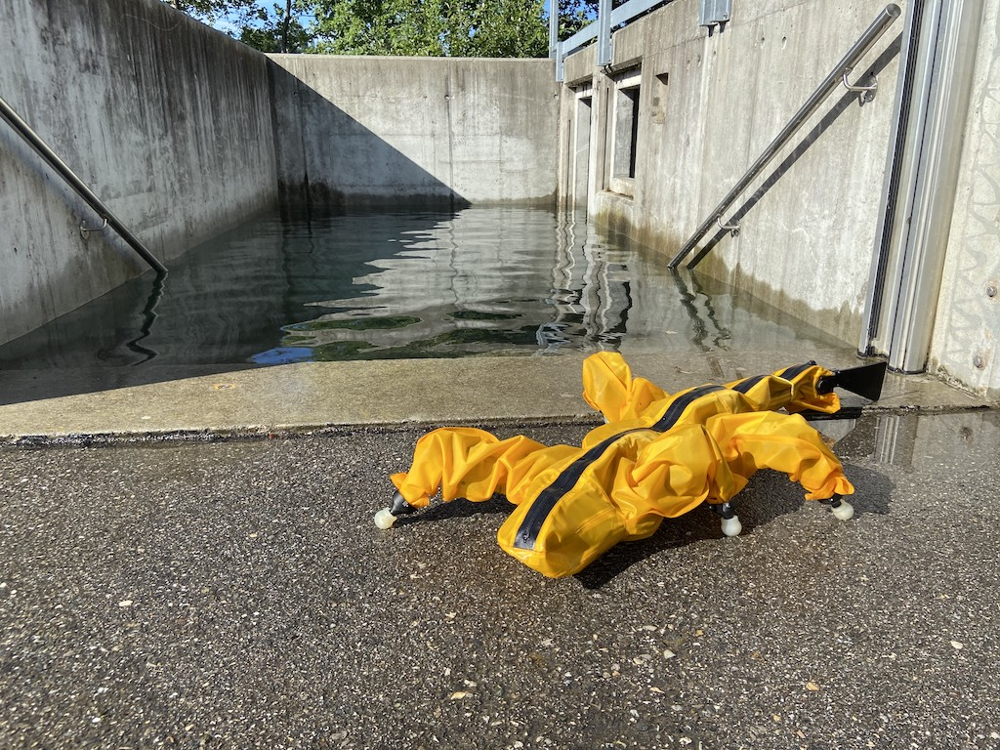
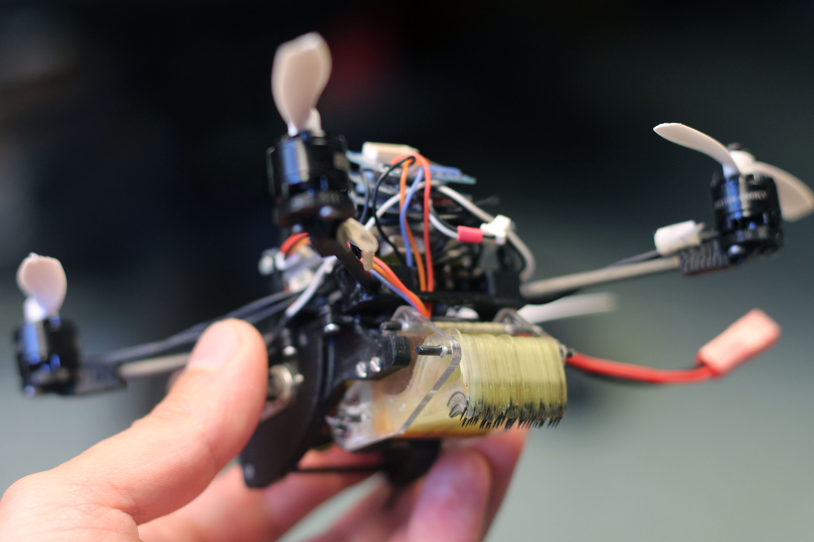
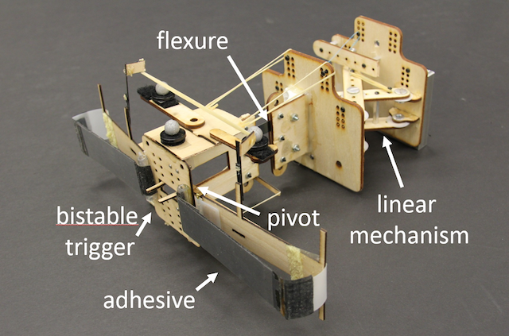
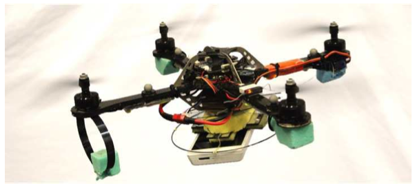

## Research

See [Google Scholar](https://scholar.google.com/citations?user=R6kgerwAAAAJ&hl=en) for a complete list of publications.

### Amphibious Field Robot  

<!--  -->
 

I was the maintainer continuing develpment of our k-rock 2 sprawling-gait quadruped robot, made up of 21 Dynamixel motors and controlled via an ODROID XU4 running Linux. I implemented a surface swimming gait on the robot via an undulating tail and spine. We are using simulation and laboratory experiments to predict what obstacles the robot can and cannot traverse.  

Engineering work has involved layering ROS onto the C++ controller architecture and revamping our compilation procedure with CMake. I recruit and supervise projects, internships, and collaborations on the hardware.

- [Robot controller repository](https://gitlab.com/biorob-krock/krock-controller)
- [Traversability estimation repo](https://gitlab.com/biorob-krock/idsia-traversability) (IDSIA collaboration)

---

### Flying, Tugging, Micro Air Vehicles

 

Work with the [Laboratory of Intelligent Systems](https://lis.epfl.ch/) at EPFL during my PhD exchange under a [Swiss scholarship](https://www.sbfi.admin.ch/sbfi/en/home/bildung/scholarships-and-grants/swiss-government-excellence-scholarships-for-foreign-scholars-an.html) and [NSF GROW](https://www.nsf.gov/funding/pgm_summ.jsp?pims_id=504876).
We combined aerial locomotion with the ability to tug with high forces by attaching onto the environment with adhesives. 

- [Science Robotics Paper](http://robotics.sciencemag.org/content/3/23/eaau6903)
- [Stanford News](https://news.stanford.edu/2018/10/24/small-flying-robots-haul-heavy-loads/)
- [MIT Technology Review](https://www.technologyreview.com/the-download/612344/wasp-inspired-robots-can-lift-40-times-their-own-weight-and-work-together-to/)
- [Wired](https://www.wired.com/story/wasp-like-drones/)
- [Science Magazine](https://www.sciencemag.org/news/2018/10/tiny-wasp-inspired-drone-can-pull-40-times-its-own-weight)
- [EPFL News](https://news.epfl.ch/news/small-flying-robots-able-to-pull-objects-up-to-40-/)
- [AAAS Eureka Alert](https://www.eurekalert.org/pub_releases/2018-10/su-sf102218.php)
- [Publico (en español)](https://www.publico.es/ciencias/robotica-desarrollan-mini-drones-forzudos-capaces-equipo.html)
- [IEEE Spectrum](https://spectrum.ieee.org/automaton/robotics/drones/tiny-drones-team-up-to-open-doors)
- [Design Engineering Magazine](https://www.design-engineering.com/this-tiny-drone-can-haul-40-times-its-weight-1004032398/)
- [Discover Magazine Blog](http://blogs.discovermagazine.com/d-brief/2018/10/24/wasp-drones-pull/)

---

### NASA Free Flyer Gripper

 

Collaboration between the The Biomimetics and Dexterous Manipulation Lab and [Autonomous Systems Lab](http://asl.stanford.edu/) on a NASA Early Stage Innovations grant. 
We were aiming to equip [Assistive Free Flyers](http://ssl.mit.edu/spheres/) (AFFs), small robots on the International Space Station, with gecko-gripper appendages to aid astronauts.  

My contribution focused on adapting a curved surface, gecko adhesive gripper for use on a free flyer table. 
Applications may entail grasping the surfaces of uncooperative objects, with some misalignment and relative velocity.
To this end, we modeled force constraints of the gripper and dynamics while grasping translating, spinning objects. We experimentally verified the boundaries of successful grasp conditions on a 2D testbed. 

- [Video](https://www.youtube.com/watch?v=1yS63Nrak1Q)
- [Paper](https://ieeexplore.ieee.org/document/7989329/)
- [Paper](https://ieeexplore.ieee.org/document/7487696/)
- [NASA ESI Grant](http://www.nasa.gov/feature/assistive-free-flyers-with-gecko-inspired-adhesive-appendages-for-automated-logistics-in)

<!-- <!-- == KlingOn, a Perching Climbing Prototype
{}{img_left}{images/klingon_glamour.jpg}{alt text}{150}{}{}
A small multimodal prototype capable of being thrown at vertical glass, sticking, and proceeding to climb up.
This was an challenge in mechanically coordinating a climbing gait with a single actuator, which ultimately involved linkages, latches, and cams. 
# Applications envision a quickly deployable robot that you can toss up to a hard-to-reach surface on a structure (ie bridge, dam, skyscraper etc) and have scutter around for a close inspection of a surface. 

#The first platform capable of perching and climbing, I'm using the KlingOn to explore perching strategies for platforms incapable of flight.
#Biology also offers many exciting examples; I did a short collaboration with folks at Berkeley's [http://polypedal.berkeley.edu/ PolyPEDAL Lab] and outfitting the robot with an inertial appendage to actively control its orientation as it flies ballistically through the air. 
#I'm also doing dynamic modeling on the role of compliance in the tail. 

[https://ieeexplore.ieee.org/document/6907472/ Paper] \n
[http://bdml.stanford.edu/Main/MultiModalRobots BDML multimodal robots] \n -->

---

### Perching Micro Air Vehicles

 

I was part of our group enabling MAVs to perch and take a rest on vertical surfaces. 
With a typical mission life lasting on the order of 20 minutes, it is a welcome break for the MAV to collect data or recharge. 

We designed gecko adhesive grippers that will stick to smooth, flat surfaces and collaborated with a controls group at UPenn to demonstrate perching under indoor motion capture. 

- [NYtimes "What You Get When You Blend a Drone and a Gecko"](http://www.nytimes.com/2015/05/16/science/robot-part-drone-part-gecko.html?_r=0)
- [Video on our collaboration with Vijay Kumar's group at UPenn](https://www.youtube.com/watch?v=P1t_cZqgsR8)
- [BDML perching page](http://bdml.stanford.edu/Main/DynamicRotorcraftPerchingMechanisms)

---

### Sensing Footpad (MIT Undergraduate Research)

 

I designed and manufactured the structure of a soft force sensor for my senior thesis in the Biomimetics and Dexterous Manipulation Lab at MIT. I was supervised by (then) graduate student Michael Chuah, who implemented the signal processing and neural network to calibrate force readings. The force sensor was intended for use in the paw pad of the MIT Cheetah. 

I used a series of 3D printed molds to cast a woven fiberglass cloth into a polyurethane film that encased a softer silicone. Hall effect sensors were mounted above magnets on the deformable pad and this deflection between these was correlated force. 

- [Paper](https://ieeexplore.ieee.org/abstract/document/6386239/)
- [Undergraduate thesis](https://dspace.mit.edu/handle/1721.1/74436)
