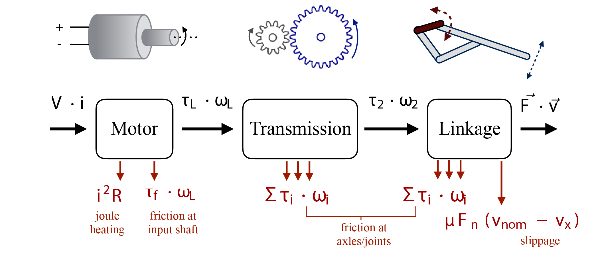

# Teaching Assistantships

### EPFL CS-432: Computational Motor Control (2020)

Supporting TA helping students through python assignments. Material pertained to the simulation of muscle models and central pattern generator based controllers of articulated robot and animal models. 

### Stanford ME112: Mechanical Systems Design (2016 & 2014)

I was a teaching assistant under my advisor Mark Cutkosky for winter quarter 2014, and head TA winter 2016. The class was a mix of problem sets, structured labs, and two projects. We taught gears, DC motors, linkage design, and efficiencies through the system. My favorite parts of the class was seeing "Aha" moment as students realized how different pieces analysis taught in lectures were finally applied to trace energy flow from battery to useful motion in their lego-crawlers or biomimetic final projects. 

- [Paper  recapping ME112 final projects](https://link.springer.com/chapter/10.1007/978-3-319-63537-8_47)
- [Video of typical mid-term crawler project (TA-built trial-run)](https://www.youtube.com/watch?v=Ci7ZCVXoLwg)

 